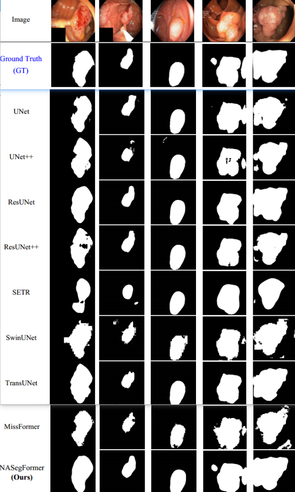

# 🎆NA-SegFormer: A multi-level Transformer model based on neigh-borhood attention for colonoscopic polyp segmentation🎆

**This repository contains the official Pytorch implementation of training & evaluation code for** [[NAFormer](https://github.com/promisedong/NAFormer)]🔥

<div align="center">
  
</div>
<p align="center">
  Fig. 1. The overall frame diagram of the NAFormer network(Green is the Transformer architecture diagram, where the TransFormer block with FFN corresponds to the white dashed box; Orange is the semantic distribution alignment of the decoding stage; )
</p>

## Abstract:
**In various countries worldwide, the incidence of colon cancer-related deaths has been on the rise in recent years. Early detection of symptoms and identification of intestinal polyps are crucial for improving the cure rate of colon cancer patients. Automated computer-aided diagnosis (CAD) has emerged as a solution to the low efficiency of traditional methods relying on manual diagnosis by physicians. Deep learning is the latest direction of CAD development and has shown promise for colonoscopic polyp segmentation. In this paper, we present a multi-level encoder-decoder archi-tecture for polyp segmentation based on the Transformer architecture, termed NA-SegFormer. To improve the performance of existing Transformer-based segmentation algorithms for edge seg-mentation on colon polyps, we propose a patch merging module with a neighbor attention mech-anism based on overlap patch merging. Since colon tract polyps vary greatly in size and different datasets have different sample sizes, we used a unified focal loss to solve the problem of category imbalance in colon tract polyp data. To assess the efficacy of our proposed method, we utilized video capsule endoscopy and typical colonoscopy polyp datasets, as well as a dataset containing surgical equipment. On the datasets Kvasir-SEG, Kvasir-Instrument and KvasirCapsule-SEG, the Dice score of our proposed model reached 94.30%, 94.59% and 82.73%, with an accuracy of 98.26%, 99.02% and 81.84% respectively. The proposed method achieved inference speed with an Frame-per-second (FPS) of 125.01. The results demonstrated that our suggested model effec-tively segmented polyps better than several well-known and latest models. In addition, the pro-posed method has advantages in trade-off between inference speed and accuracy, and it will be of great significance to real-time colonoscopic polyp segmentation. The code is available at https://github.com/promisedong/NAFormer.**


## Installation
**We use [Pytorch2.1.1 + CUDA11.8] as  a software configuration environment.**

### Environment Installation
```
conda create -n NAFormer python=3.8
conda activate NAFormer
conda install pytorch torchvision torchaudio cudatoolkit -c pytorch

pip config set global.index_url=http://mirrors.aliyun.com/pypi/simple/
pip install -r requirements.txt
```

## Dataset 
- Kvasir- SEG dataset: https://datasets.simula.no/kvasir-seg/
- The KvasirCapsule-SEG dataset is a publicly available dataset that can be found at Simula Datasets - Kva-sirCapsule SEG.
- Kvasir-Instrument dataset:  https://datasets.simula.no/kvasir-instrument/

<div align="center">
  
</div>
<p align="center">
  Dataset Description
</p>

## Results
### Comparison with the Latest Methods 
* **Quantitative analysis on the Kvasir-SEG. Bolded parts represent better performance, and the parts marked with * indicate suboptimal.**
<div align="center">
  
</div>
<p align="center">
</p>

*  ***Segmentation examples of the compared methods on the Kvasir-SEG dataset.***
<div align="center">
  
</div>
<p align="center">
</p>


* ***Impacts comparison of each module (Bolded parts represent better performance).***
<div align="center">
  
</div>
<p align="center">
 Impacts comparison of each module (Bolded parts represent better performance).
</p>

* **Visualization results with heat maps and fine grained segmentation area presentation of ablation experiments in the Kvasir-SEG dataset. (In the last four columns, Green denotes TP; Blue denotes FP; Yellow denotes FN; Gray denotes TN )**
<div align="center">
  
</div>
<p align="center">
    Visualization results with heat maps and fine grained segmentation area presentation of ablation experi-ments in the Kvasir-SEG dataset. (In the last four columns, Green denotes TP; Blue denotes FP; Yellow denotes FN; Gray denotes TN )
</p>


## License
 The code is released under the MIT license[](https://opensource.org/licenses/MIT).

## Relevant Projects
**[1] https://github.com/gasking/ASDA** 
***[2] MISSFormer: An Effective Transformer for 2D Medical Image Segmentation  - IEEE TRANSACTIONS ON MEDICAL IMAGE*** [**[arXiv](https://arxiv.org/abs/2105.05013) [code](https://github.com/BIT-DA/SDCA)**]

- ***Thanks for their nice contribution.***
